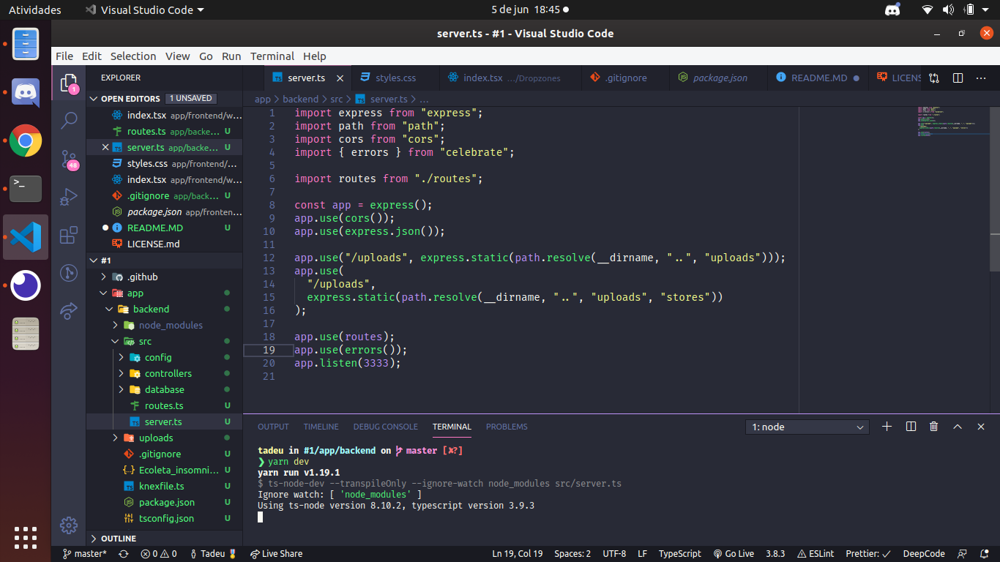
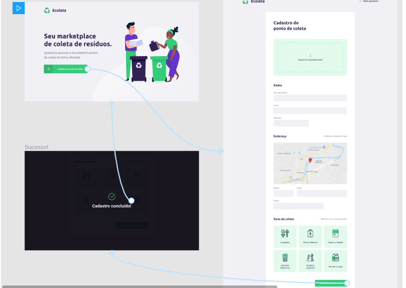
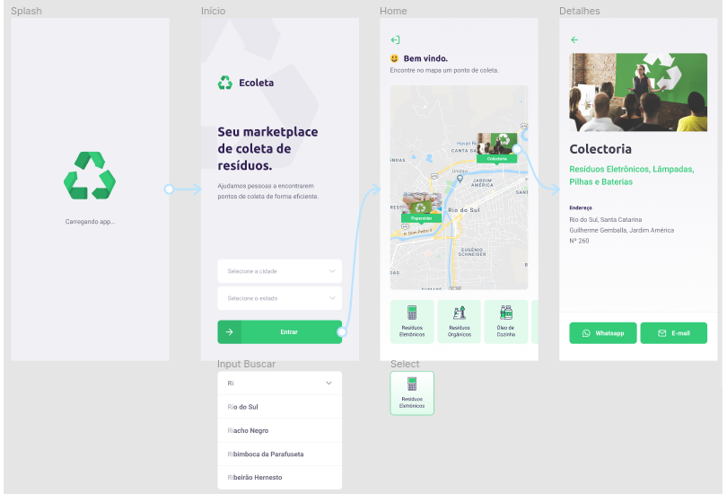

<h1 align="center">
  
  <br/>
  
</h1>

<p align="center">
  

  
  
  <a href="https://github.com/TadeuA/NLW-1/commits/master">
    
  </a>

  <a href="https://github.com/TadeuA/NLW-1/issues">
    
  </a>

  <a href="https://github.com/TadeuA/NLW-1/blob/master/LICENSE.md">
    
  <a>
</p>

<p align="center">
  <a href="#rocket-tecnologias">Tecnologias</a>&nbsp;&nbsp;&nbsp;|&nbsp;&nbsp;&nbsp;
  <a href="#-projeto">Projeto</a>&nbsp;&nbsp;&nbsp;|&nbsp;&nbsp;&nbsp;
  <a href="#-backend">Backend</a>&nbsp;&nbsp;&nbsp;|&nbsp;&nbsp;&nbsp;
  <a href="#-frontend">Frontend</a>&nbsp;&nbsp;&nbsp;|&nbsp;&nbsp;&nbsp;
    <a href="#-WEB">WEB</a>&nbsp;&nbsp;&nbsp;|&nbsp;&nbsp;&nbsp;
  <a href="#-mobile">Mobile</a>&nbsp;&nbsp;&nbsp;|&nbsp;&nbsp;&nbsp;
  <a href="#-instalação">Instalação</a>&nbsp;&nbsp;&nbsp;|&nbsp;&nbsp;&nbsp;
  <a href="#-instalação">Como contribuir</a>&nbsp;&nbsp;&nbsp;|&nbsp;&nbsp;&nbsp;
  <a href="#memo-licença">Licença</a>
</p>

<br>

---

## 💻 Projeto

  <h1 align="center">
  
  
  
  
 </h1>

Projeto desenvolvido durante a <strong>Next Level Week</strong> que ocorreu em paralelo com a semana iternacional do meio ambiente, e foi desenvolvido em sua homenagem.
O <strong>Ecoleta</strong> serve como um Marketplace, uma conexão entre empresas ou entidade que coletam resíduos, sejam eles orgânicos ou inorgânicos, à pessoas que precisam fazer descarte dos resíduos da maneira certa e ecológica.

## 🚀 Tecnologias

Esse projeto foi desenvolvido com as seguintes tecnologias:

- [TypeScript](https://github.com/Microsoft/TypeScript)
- [Node.js](https://nodejs.org/en/)
- [React](https://reactjs.org)
- [React Native](https://facebook.github.io/react-native/)
- [Expo](https://expo.io/)
- [API do IBGE para consumo do endereço](https://servicodados.ibge.gov.br/api/docs/localidades?versao=1#api-UFs-estadosGet)
- [Upload de imagens](react-dropzone)
- [Leaflet](https://leafletjs.com/examples/quick-start/)
- [Celebrate](https://github.com/arb/celebrate)
- [Knex](http://knexjs.org/)
- [Axios](https://github.com/axios/axios)
- [Express](https://expressjs.com/pt-br/guide/routing.html)

## 🔨 Backend

  <h1 align="center">
    

  <h1 align="center">
    
  </h1>

</h1>

O back-end foi construido com [Node.js](https://nodejs.org/en/), todo escrito com [TypeScrip](https://github.com/Microsoft/TypeScript) que quando compilado gera code JavaScript puro.

O [Express](https://expressjs.com/pt-br/guide/routing.html) foi usado para lidar com as rotas de forma simples e eficaz, e foi aplicado o [Cors](https://github.com/expressjs/cors) assim possibilitando uma conexão mais segura e o [Celebrate](https://github.com/arb/celebrate) para validar as requisições.

O [Knex](http://knexjs.org/) foi o ORM escolhido para o nosso gerenciamento com banco de dados que em ambiente de desenvolvimento esta sendo usado o SQLite3, assim com o [Multer](https://github.com/expressjs/multer) é possível gerir os arquivos recebidos facilmente.

O [Insomnia](https://insomnia.rest/) nos auxiliou para testar as requisições de nossas rotas.

<h1 align="center">

<a 
  href="https://insomnia.rest/run/?label=Ecoleta&uri=https%3A%2F%2Fgithub.com%2FTadeuA%2FNLW-1%2Fblob%2Fmaster%2Fbackend%2FEcoleta_insomnia.json" target="_blank">

</a>


</h1>

## 🚀 FrontEnd

 <h1 align="center">
    
  </h1>
  
Todo construído em [React](https://reactjs.org) e escrito em [TypeScript](https://github.com/Microsoft/TypeScript).
Para obter a conexão com as api's esta sendo usado [Axios](https://github.com/axios/axios)s.

## 🌐 WEB

Para a montagem da dom foi usado o [react-dom](https://pt-br.reactjs.org/docs/react-dom.html) e o [react-dropzone]() para lidar com o recebimentos e preview das imagens, para upload.
Foi integrado um mapa interativo do [Leaflet](https://leafletjs.com/examples/quick-start/) e conectado com a api do [IBGE](https://servicodados.ibge.gov.br/api/docs/localidades?versao=1#api-UFs-estadosGet) para obter Estados e Cidades.

  <h1 align="center">
    
  </h1>
  
## 📱 Mobile
  Na cosntrução do app mobile, usamos o [Expo]() para acesso às API’s nativas, e [React Native]()para o desenvolvimento da aplicação.
  O [Expo]() forneceu mapa interativo, fontes, gps entre outras funcionalidades.
  <h1 align="center">
    
  </h1>

## 🔥 Instalação

```bash
# Clone este repositório
$ https://github.com/TadeuA/NLW-1.git

# Navegue até a pasta server e execute os seguintes comandos:
$ yarn knex:migrate
$ yarn knex:seed
$ yarn dev:server

# Depois disso, entre na pasta web e execute o comando:
$ yarn start

# E finalmente, entre na pasta mobile e execunte o comando:
$ expo start

# Observações:
- Não esqueça de mudar a baseURL no arquivo api.ts das pastas web e mobile para o ip da sua máquina
```

## 🤔 Como contribuir

- Faça um fork desse repositório;
- Cria uma branch com a sua feature: `git checkout -b minha-feature`;
- Faça commit das suas alterações: `git commit -m 'feat: Minha nova feature'`;
- Faça push para a sua branch: `git push origin minha-feature`.

Depois que o merge da sua pull request for feito, você pode deletar a sua branch.

## 🧾 Licença

Esse projeto está sob a licença MIT. Veja o arquivo [LICENSE](LICENSE.md) para mais detalhes.

---

🔨 Built by [Tadeu Agostini](https://www.linkedin.com/in/tadeu-agostini-498826147/)
